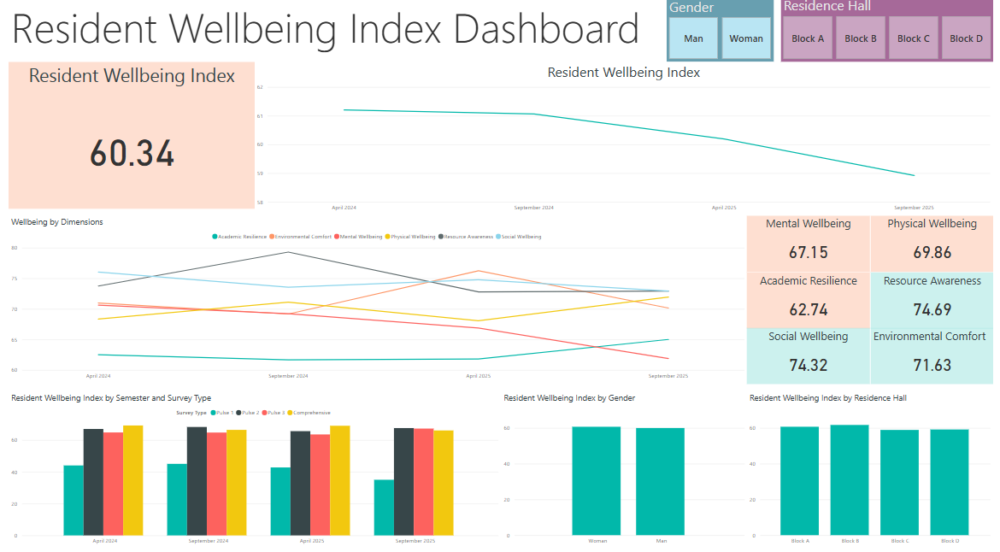

# 🏡 Resident Wellbeing Index (RWI) – Data-Driven Framework for University Housing

This project showcases a structured, analytics-driven system to assess and improve **resident wellbeing** in a university residence hall setting. It uses live survey data collected across four phases of the semester and visualizes insights via a Power BI dashboard. 

---

## 🎯 Objective

To develop a lightweight, scalable **Resident Wellbeing Index (RWI)** using:
- Microsoft Forms (survey data collection)
- Python (scoring and dimension weighting)
- Power BI (interactive dashboard)
- GitHub (project documentation & transparency)

The RWI helps residence teams:
- Monitor mental, physical, and social wellbeing
- Identify early warning signs (e.g., burnout)
- Make data-informed decisions to support residents
- Align programming with student needs

---

## 🧩 Core Wellness Dimensions

| Dimension               | Description                                                    |
|------------------------|----------------------------------------------------------------|
| **Mental Wellbeing**    | Emotional stability, stress, confidence, coping mechanisms     |
| **Physical Wellbeing**  | Sleep, nutrition, physical activity                            |
| **Social Wellbeing**    | Peer connections, sense of belonging, support networks         |
| **Environmental Comfort** | Room quality, cleanliness, study space                        |
| **Resource Awareness**  | Knowledge and use of support services                          |
| **Academic Resilience** | Ability to manage workload, stress, and study-life balance     |

> 📘 These dimensions are rolled into a single RWI score (0–100), with customizable weightings.

---

## 🧠 Resident Wellbeing Index (RWI) Weighting

The RWI score is calculated based on the average scores of each dimension, weighted to reflect its relative impact on wellbeing:

```python
dimension_weights = {
    "Mental Wellbeing": 25,
    "Physical Wellbeing": 15,
    "Social Wellbeing": 20,
    "Environmental Comfort": 10,
    "Resource Awareness": 15,
    "Academic Resilience": 15
}
```
🔁 Reverse-coded items (e.g., “I feel burnt out”) are accounted for in Python using inverted scoring logic.

---

## 📋 Microsoft Forms: Survey Links

Live surveys used to collect wellness data at different phases of the semester:

| Survey Type       | Timing               | Link                                                                 |
|-------------------|----------------------|----------------------------------------------------------------------|
| 🟢 Pulse 1         | Early in the semester | [Open Pulse 1 Survey](https://forms.office.com/r/Ypgs47treY)         |
| 🟡 Pulse 2         | Mid-semester          | [Open Pulse 2 Survey](https://forms.office.com/r/JPLKVzcyJH)         |
| 🔴 Pulse 3         | Just before finals    | [Open Pulse 3 Survey](https://forms.office.com/r/YM1BWY2hPk)         |
| 🌐 Comprehensive   | Post-semester         | [Open Comprehensive Survey](https://forms.office.com/r/tf63JwLx5b)   |

> Each survey targets wellness dimensions relevant to its timing (e.g. onboarding, stress peaks, reflection).

---

## 📊 Power BI Dashboard

Due to publishing restrictions, the Power BI dashboard is not public. However, you can still explore it:


[View Dashboard Summary PDF](./powerbi/dashboard_summary.pdf)
 

### 🔍 Dashboard Visuals Include:

- 📈 **Line chart**: RWI & dimension trends over time  
- 📊 **Stacked columns**: RWI by gender, survey, and residence hall  
- 💡 **KPI Cards**: Averages for each wellness dimension  
- 🧭 **Filters**: Survey type, residence hall, gender  

---

## 🧪 Data Processing

Python was used to:

- Reverse-score negative wellbeing questions  
- Normalize Likert scale responses (1–5)  
- Apply dimension-specific weights  
- Output a final RWI   

📁 [View the script](./data_processing/rwi_calculation.py)  
📄 [Sample data input](./data_processing/sample_input_data.csv)

---

## 📚 Documentation

- 📘 [Question Bank by Dimension](./docs/question_bank.md)  
- 📗 [Example Mapping of Dimensions Across Surveys](./docs/example_mapping.md)

---

## 🛠️ Tech Stack

| Tool              | Purpose                                         |
|------------------|-------------------------------------------------|
| **Power BI**      | Interactive dashboards and trend monitoring     |
| **Python**        | Scoring logic and RWI calculation               |
| **Microsoft Forms** | Survey deployment and data collection          |
| **GitHub**        | Documentation and project showcase              |
| **CSV + Excel**   | Data formatting and transfer                    |


---

## 📌 Future Enhancements

- 🔁 Export to SharePoint or MS Teams with Power Automate  
- 📡 Integration with Microsoft Dataverse for real-time RWI updates  
- 🤖 AI-based insight generator (e.g., Copilot summary per residence hall)

---

## Contact
For questions or collaboration, reach out at [daphne.danaraj@gmail.com].

